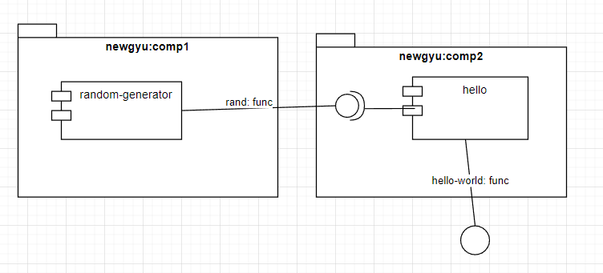

# What's this?

This is an example to understand [WASM Component Model](https://github.com/WebAssembly/component-model) with [cargo-component](https://github.com/bytecodealliance/cargo-component).

# Example case

There are two packages, then each package has a world.
- `newgyu:comp1/random-generator`
  - `rand` func is exported.
- `newgyu:comp2/hello`
  - `hello-world` func is exported, and that depends on `rand` func that is provided by `newgyu:comp1`.